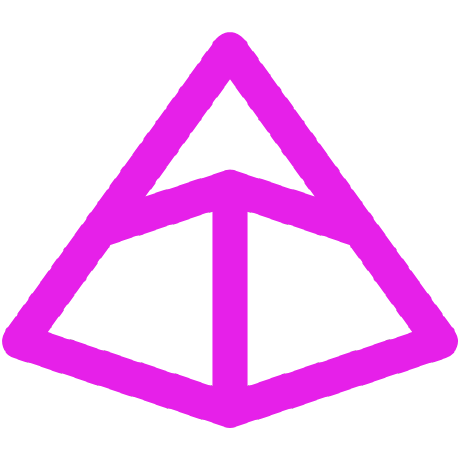

# 👾 Opa, me chamo Henrique Luza:

Estudante de Engenharia da Computação e aprendendo sobre Ciência de Dados, Desenvolvimento Full-Stack e Desenvolvimento Mobile.

# 🧠 Sobre mim:

* Estudante de Engenharia da Computação do UniCeub;
* Gosto de resolver desafios e encontrando soluções para problemas;
* Entre em contato através de henriqueluza@gmail.com;
* Estudando desenvolvimento web fullstack;
          
# 💻 Tech Stack:

### 🐍 Desenvolvimento Web - Frontend

  
          
          
          
          
          
          
          <!--  -->
          

### 🌐 Frameworks & APIs

          
  
  
          
  
  
  

  

### 📊 Data Science & Machine Learning
  
  
  
  
  
  

### 🗄️ Bancos de Dados

  
  
  
          
          

### ⚙️ DevOps, MLOps & Ferramentas

  
  <!--  -->
  

# 📊 Stats:

  
          
  
   
  
   

## 🌐 Socials

